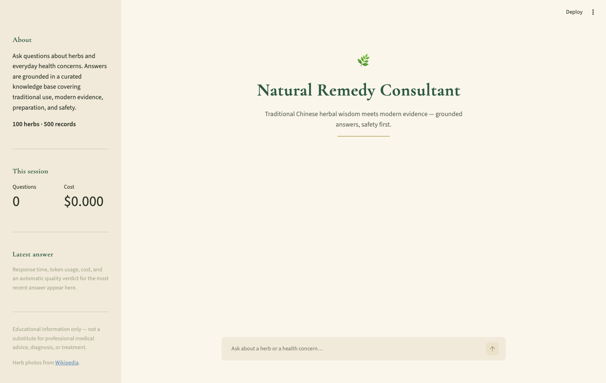
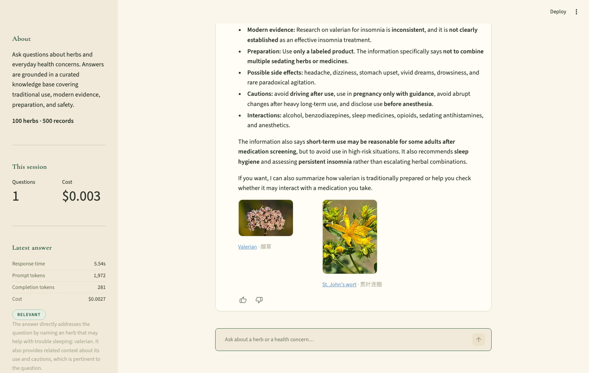
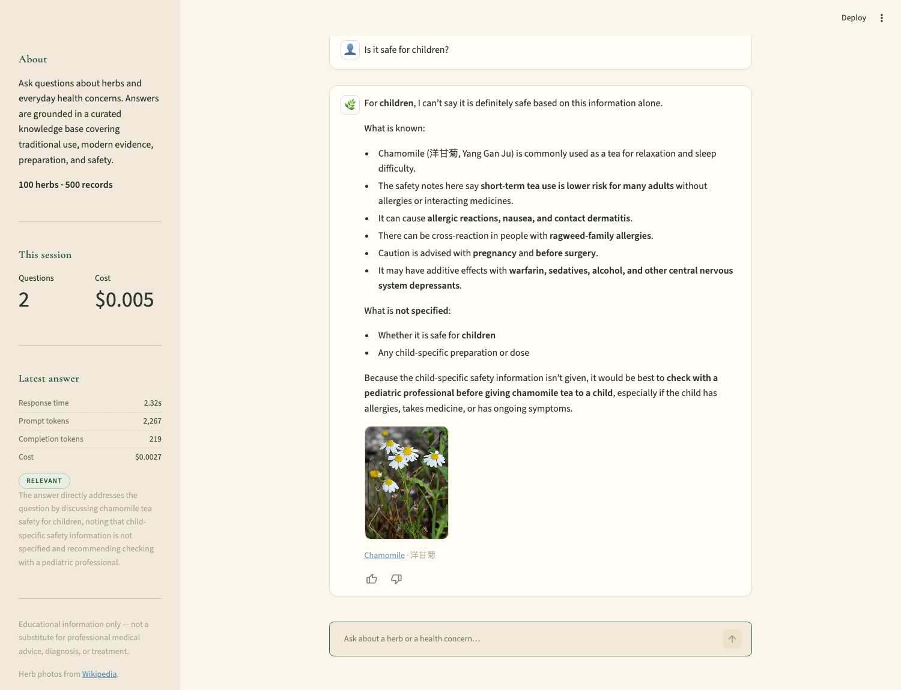
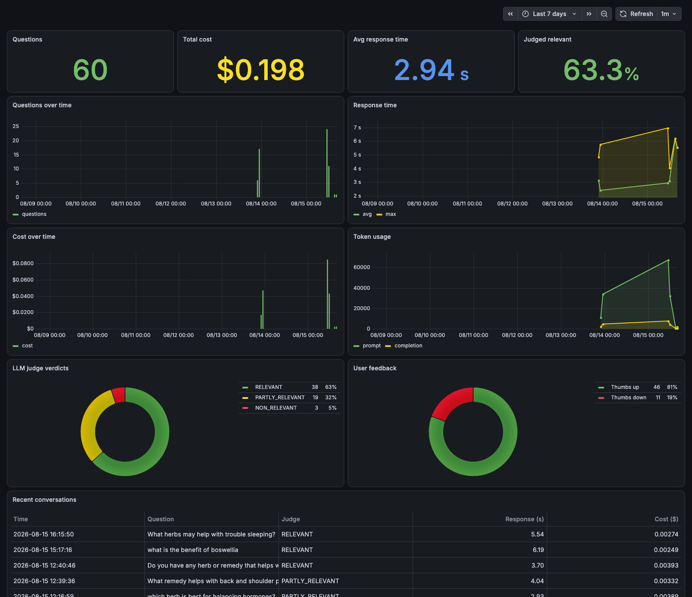

# Natural Herbal Remedy Consultant

This is a natural remedy consultant with knowledge from the Chinese traditional herb bible HuangDiNeiJing, built as a RAG application for the LLM Zoomcamp project.

Ask a question about herbs or everyday health concerns and get a grounded, safety-first answer — with photos of the herbs, bilingual names, and live quality monitoring:





## Problem Description

Information about natural remedies is often scattered across traditional medical texts, herbal references, modern research, and safety resources. This makes it difficult to quickly answer practical questions such as what natural remedies may help with sleep, a common cold, nausea, or other everyday concerns, while also understanding their traditional uses, modern scientific evidence, preparation methods, side effects, and drug interactions.

This project addresses that problem by building a Retrieval-Augmented Generation (RAG) assistant over a curated natural-remedies dataset. A user can ask a question in natural language, and the application retrieves relevant information about herbs and remedies before providing a grounded response.

The assistant is intended for educational and research purposes and not as a replacement for professional medical diagnosis or treatment.

## Technologies

* [Minsearch](https://github.com/alexeygrigorev/minsearch) - for text and vector search
* all-MiniLM-L6-v2 (ONNX, run locally) - for embedding the records and queries used by vector search
* OpenAI as an LLM
* Streamlit as the web interface (see [Background](#background) for more information)
* [Prefect](https://www.prefect.io/) - for the automated ingestion pipeline
* PostgreSQL - for storing conversations and feedback
* [Grafana](https://grafana.com/) - for the monitoring dashboard
* [hyperopt](https://hyperopt.github.io/hyperopt/) - for tuning retrieval parameters
* Docker and Docker Compose - for containerization

## Running it with Docker

The easiest way to run this application is with docker. The whole stack — the Streamlit app ([Dockerfile](Dockerfile)), Postgres, and Grafana — is defined in [docker-compose.yaml](docker-compose.yaml).

First create the `.env` file (see [Configuration](#configuration) — the `POSTGRES_*` defaults work as-is, you only need your OpenAI key), then:

```bash
docker compose up --build
```

Then open the app at http://localhost:8501. The first startup downloads the ~90 MB embedding model and builds the search index, so give it a minute. Database tables are created automatically on startup.

Grafana runs at http://localhost:3000 (login `admin` / `admin`) — see [Monitoring](#monitoring) for creating the dashboard.

## Running Locally

### Installing the dependencies

If you don't use docker and want to run locally, you need to manually prepare the environments and install all the dependencies

We use [uv](https://docs.astral.sh/uv/) for managing dependencies, with Python 3.12.

Make sure you have uv installed:

```bash
pip install uv
```

Installing the dependencies:

```bash
uv sync
```

### Configuration

The application uses OpenAI as the LLM provider. Put your API key in a `.env` file in the project root:

```
OPENAI_API_KEY=your-key-here
POSTGRES_DB=natural_remedy_assistant
POSTGRES_USER=user
POSTGRES_PASSWORD=password
POSTGRES_HOST=localhost
```

The same file is used by Docker Compose (for the containers) and by the local run.

### Running the application

For running the application locally, do this:

First, ingest the knowledge base (see [Ingestion](#ingestion) for details):

```bash
make ingest
```

Then start the Streamlit application:

```bash
make chat
```

and open http://localhost:8501 in your browser.

You can also ask a one-off question from the command line, without the UI:

```bash
make run
```

or with your own question:

```bash
uv run python natural_remedy_consultant/assistant.py "What herbs may help with nausea?"
```

## Preparing the application

The database tables are created automatically when the app starts (see [`db_init.py`](natural_remedy_consultant/db_init.py) — the initialization is idempotent). If you run locally with `make chat`, start the database first:

```bash
make postgres
```

You can also initialize the tables manually with `make db-init`.

## Using the application

Start the application either with docker compose or locally, open http://localhost:8501, and ask questions in the chat. Each answer shows pictures of the herbs it is based on, and you can rate answers with 👍/👎 — both the conversations and your feedback are stored in Postgres and feed the monitoring dashboard.

## Interface

The application has two interfaces:

- **Web UI (Streamlit)** — a chat interface for interactive use ([natural_remedy_consultant/app.py](natural_remedy_consultant/app.py)), started with `make chat`. You ask questions in natural language and get answers grounded in the knowledge base. The conversation history is kept for the browser session, and the knowledge-base index is built once at startup and cached across interactions.
- **Command line** — one-off questions through [natural_remedy_consultant/assistant.py](natural_remedy_consultant/assistant.py), run with `make run`. Useful for quick checks and scripting.

The chat also supports **follow-up questions** — here, "Is it safe for children?" is understood to be about the chamomile discussed just before, and the assistant is explicit about what the knowledge base does and does not cover:



## Retrieval Flow

For the code of the retrieval flow, check [notebooks/consultant.py](notebooks/consultant.py) — a minimal end-to-end version of the flow: user question → knowledge-base search → retrieved records built into a prompt → grounded LLM answer.

It is built from two helper modules in the same folder:

1. [notebooks/ingest.py](notebooks/ingest.py) — loads the knowledge base and builds the minsearch index over its text fields
2. [notebooks/rag_helper.py](notebooks/rag_helper.py) — `RAGBase`, which orchestrates the flow: search the index, build the context and prompt from the retrieved records, and generate the answer with the LLM under safety-first instructions

The different retrieval approaches — text, vector, and hybrid search, with [notebooks/embedder.py](notebooks/embedder.py) providing the embeddings — are evaluated in [notebooks/notebook.ipynb](notebooks/notebook.ipynb); see [Evaluation](#evaluation).

## Evaluation

For the code for evaluating the system, you can check the [notebooks/notebook.ipynb](notebooks/notebook.ipynb)

### Retrieval

We evaluated retrieval with **hit rate** and **MRR** against 2,500 LLM-generated ground-truth questions (5 per knowledge-base record).

The basic approaches, evaluated on all 2,500 questions:

| Approach | Hit rate | MRR |
|---|---:|---:|
| Text search | 0.944 | 0.591 |
| Vector search | 0.917 | 0.609 |
| **Hybrid search (RRF)** | **0.965** | **0.633** |

We then tuned search parameters with hyperopt on a 100-question validation split (per-field boost weights for text search, and the RRF fusion parameters for hybrid search) and compared all approaches on the held-out 2,400-question test split:

| Approach | Hit rate | MRR |
|---|---:|---:|
| Text search (untuned) | 0.942 | 0.591 |
| Text search (boosted) | 0.945 | 0.616 |
| Vector search | 0.915 | 0.606 |
| **Hybrid search (default)** | **0.963** | 0.631 |
| Hybrid search (tuned) | 0.946 | **0.632** |

Hybrid search wins with or without boosting. **The application uses hybrid search with default parameters** — it has the best hit rate, which matters most for RAG, since all top-5 retrieved records go into the LLM context.


### RAG Flow

We used LLM-as-a-judge to evaluate the quality of the full RAG flow, built on our best-performing retriever (hybrid search).

Since running all 2,500 ground-truth questions is costly, we sampled 200 test questions and compared two answering models with a fixed judge model (gpt-5.4-mini). The judge checks each answer against the source record the question was generated from.

| Answering model | Good | Bad |
|---|---:|---:|
| **gpt-5.4-mini** | **195 (97.5%)** | 5 (2.5%) |
| gpt-5.4-nano | 193 (96.5%) | 7 (3.5%) |

gpt-5.4-mini wins — **it is the model used in the application**.

## Monitoring

We monitor the application with [Grafana](https://grafana.com/), reading directly from the Postgres database where the app stores every conversation (question, answer, tokens, response time, cost) and every feedback event (LLM judge verdicts and user thumbs).

If you run with **docker compose**, Postgres and Grafana are already up — create the datasource and dashboard with:

```bash
uv run python grafana/init_grafana.py
```

If you run **locally with make**, start the stack and initialize it:

```bash
make postgres      # database (skip if already running)
make grafana       # Grafana on http://localhost:3000
make grafana-init  # creates the datasource and dashboard via the Grafana API
```

Then open http://localhost:3000 (default login `admin` / `admin`) and go to the **Natural Remedy Consultant — Monitoring** dashboard.

The dashboard is defined as code in [grafana/init_grafana.py](grafana/init_grafana.py) (idempotent — safe to re-run) and contains 11 panels:

- **Stat tiles**: total questions, total cost, average response time, and the share of answers the LLM judge rated relevant
- **Time series**: questions over time, response time (avg/max), cost over time, and token usage (prompt vs completion)
- **Donut charts**: LLM judge verdicts (relevant / partly relevant / non-relevant) and user feedback (thumbs up/down)
- **Table**: recent conversations with judge verdict, response time, and cost



> **Note for reviewers:** the dashboard *definition* ships with the repo (it is created by the init script above, and persists in the Grafana volume afterwards), but the *data* does not — a fresh database starts empty. After starting the stack, run the init script once, then ask a few questions in the app and click 👍/👎 on some answers — the panels will fill up as you interact.

## Best Practices

* **Hybrid search** — the application combines text search and vector search over the knowledge base. Both approaches are evaluated separately and combined in the retrieval evaluation ([notebooks/notebook.ipynb](notebooks/notebook.ipynb)), and hybrid search won.
* **Document re-ranking** — the results from text search and vector search are re-ranked into a single list with Reciprocal Rank Fusion (RRF); see `HybridSearcher` in [natural_remedy_consultant/ingest.py](natural_remedy_consultant/ingest.py).
* **User query rewriting** — in the chat interface, follow-up questions ("is it safe for children?") are rewritten into standalone questions using the conversation history before retrieval; see `condense_question` in [natural_remedy_consultant/rag_helper.py](natural_remedy_consultant/rag_helper.py).

## Extra Features

Beyond the rubric requirements, the application includes:

* **Retrieval parameter tuning** — search parameters (per-field boost weights for text search, and the RRF fusion parameters `k` / `num_candidates` for hybrid search) are tuned with [hyperopt](https://hyperopt.github.io/hyperopt/) on a validation split and verified on a held-out test split; see [Retrieval](#retrieval) and [notebooks/notebook.ipynb](notebooks/notebook.ipynb).
* **Conversation memory** — the chat handles follow-up questions: recent history is passed to the answering model, and retrieval uses the rewritten standalone question, so "is it safe for children?" after a chamomile question retrieves chamomile records.
* **Herb photos in answers** — every answer shows pictures of the herbs it is grounded in, with links to their Wikipedia pages. A batch script ([natural_remedy_consultant/fetch_herb_images.py](natural_remedy_consultant/fetch_herb_images.py)) fetches thumbnails for all 100 herbs via the MediaWiki batch API into a sidecar file (`data/herb_images.csv`) that has no effect on retrieval or evaluation.
* **Bilingual herb names** — herbs are always introduced with their Chinese characters and pinyin alongside the English name, e.g. "ginger (生姜, Sheng Jiang)", both in the answer text and in the photo captions.
* **Online LLM-as-a-judge** — every production answer (not just the offline evaluation) is automatically judged for relevance; the verdict is shown live in the app sidebar and stored in Postgres for the dashboard.
* **Live in-app monitoring** — the sidebar shows the latest answer's response time, token usage, cost, and judge verdict, plus running session totals.
* **Dashboard as code** — the entire Grafana setup (datasource + 11-panel dashboard) is reproducible from one idempotent script.
* **Safety-first prompting** — the assistant never generates doses, separates traditional use from modern evidence, surfaces contraindications and drug interactions, and recommends professional care for high-risk situations.

## Background

Here we provide background on some of the technologies used, and why we chose them for this project.

### Streamlit

[Streamlit](https://streamlit.io/) is an open-source Python framework for building web applications without writing any frontend code — the entire UI is declared in Python. We chose it for the chat interface because it keeps the whole project in one language and turns the RAG pipeline into a usable web app in under 50 lines of code.

Two Streamlit concepts worth knowing when reading [app.py](natural_remedy_consultant/app.py):

- **Rerun model** — Streamlit re-executes the whole script from top to bottom on every user interaction. Anything expensive must therefore be cached: we wrap `create_assistant()` (which loads the knowledge base and builds the search index) in `@st.cache_resource`, so it runs once per server process instead of on every message.
- **Session state** — `st.session_state` survives reruns, so the chat history is stored there and replayed at the top of each rerun, which is what produces the chat experience.

## Ingestion

The knowledge base is ingested with an automated [Prefect](https://www.prefect.io/) pipeline: [natural_remedy_consultant/auto_data_ingestion.py](natural_remedy_consultant/auto_data_ingestion.py)

The flow `natural-remedy-kb-ingestion` runs five tasks:

1. **extract** — reads the raw dataset `data/natural_remedies.csv`, with automatic retries on failure
2. **validate** — verifies that all columns required by the search index are present, rejects records without a `record_id`, and drops duplicate records
3. **transform** — cleans the data (removes stale index columns, fills missing values)
4. **load** — publishes the processed knowledge base to `data/knowledge_base.csv`
5. **smoke_test** — builds the full hybrid index (text + vector) from the published file and runs a test query, so a broken knowledge base can never be silently published. This also downloads the embedding model if missing and pre-computes the embeddings cache (`data/embeddings.npy`), so the app starts fast afterwards

The application ([natural_remedy_consultant/ingest.py](natural_remedy_consultant/ingest.py)) loads the `data/knowledge_base.csv` produced by this pipeline, falling back to the raw CSV if the pipeline has not been run yet.

To run the ingestion pipeline:

```bash
make ingest
```

or directly:

```bash
cd natural_remedy_consultant && uv run python auto_data_ingestion.py
```